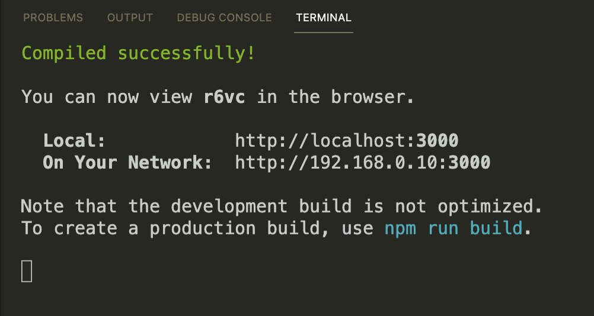

.. _resume:

Video APP
=========

The Time has Come!

We will be or we are in a project now so our commitment to generate a CODE that our team could trust is a must. I share with you a documentation of 8 libraries that helps us to manage how to standarize, document, test and deploy the code of our beloved React projects.

And never again trust in in the warning “Compiled successfully!” that’s React send us if you are not setup this:

* Jest - snapshots testing.

* React testing library - rendering test.

* React-dom/test-utils - processed and applied units to DOM testing.

* Enzyme and @wojtekmaj/enzyme-adapter-react-17 - render and event testing.

* Getusermedia -video and audio testing.

* Eslint - secure your code are under ECMAscript standars.

* Jsdoc - helps document classes or functions.

* Github Workflows - control in pull requests in new branch, merge and deploy the code.

Believe me React is lying…

It’s a Lie!

Welcome.